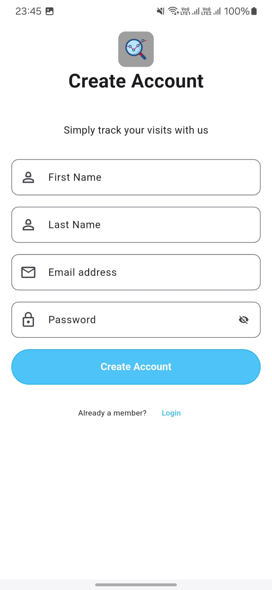
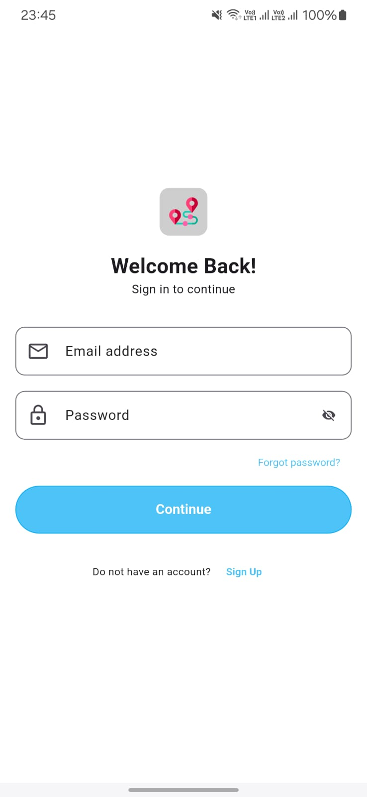
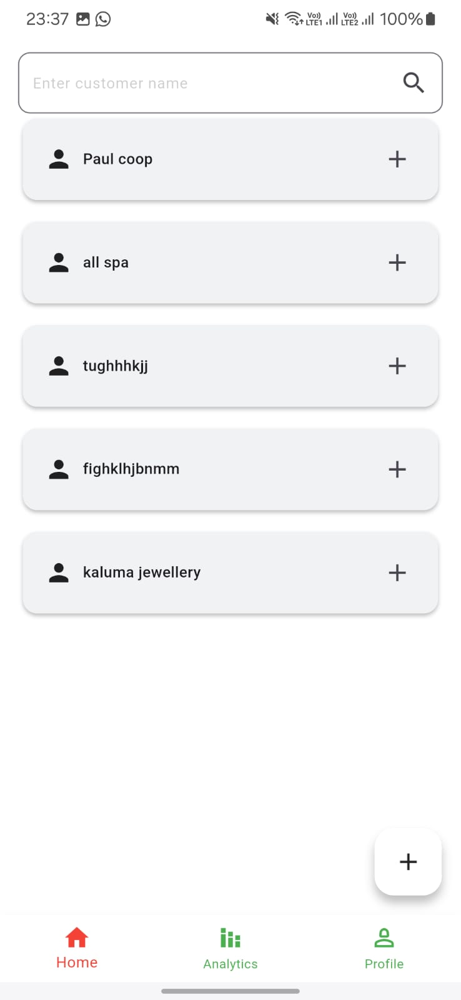
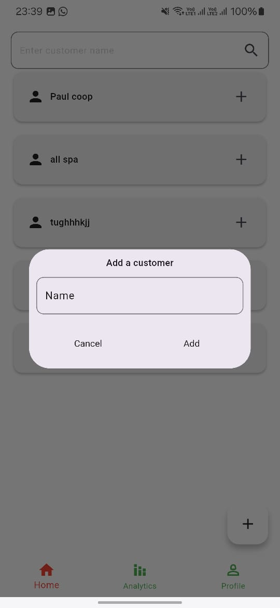
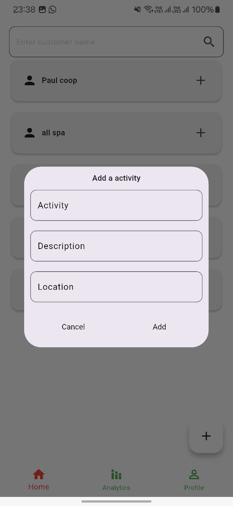
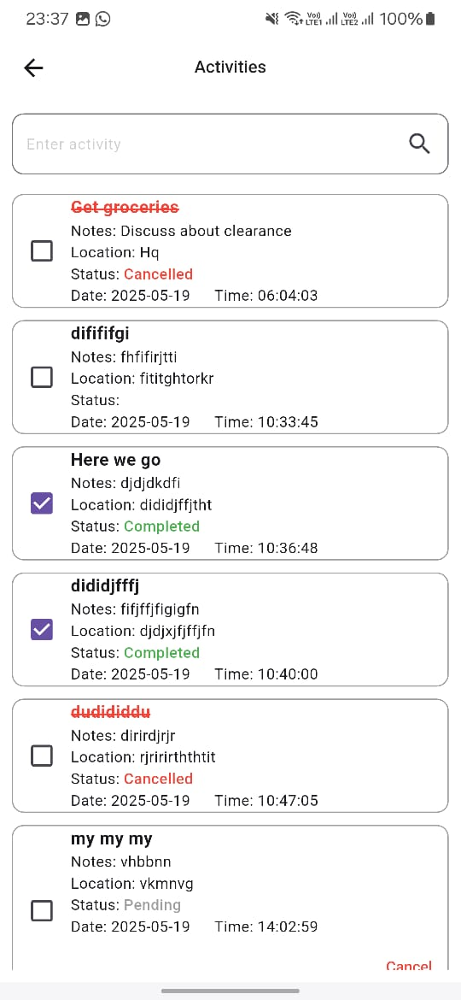
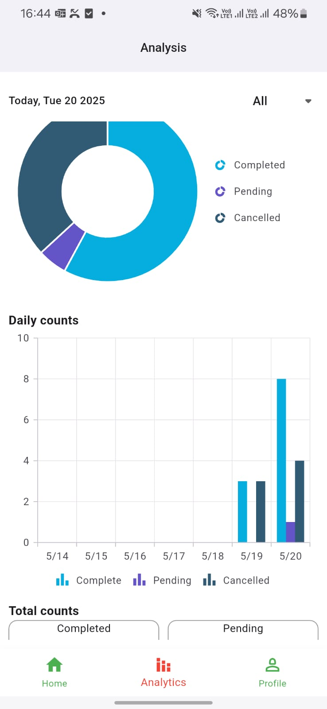

## SOLUTECH Interview Solution

👀 Solution code for the Route-to-Market (RTM) Sales Force Automation app. app for crossplatform
using [flutter](https://flutter.dev/).
The final app looks like this:

#### Auth

| Sign up page                          | Sign in page                          | Customers                           |
|---------------------------------------|---------------------------------------|-------------------------------------|
|  |  |  |

#### Home Screen

| Add Customers                             | Add visits                             | Customer activities                  |
|-------------------------------------------|----------------------------------------|--------------------------------------|
|  |  |  |

### Report Screen

| Report Section                                      |
|-----------------------------------------------------|   
|  |

### Prerequisites

- Before running this app, you need to have java 19 installed:

- Ensure the minimum sdk set above 21 and multiDexEnabled set to true on app/build.gradle:

```shell script
    defaultConfig {
        minSdk = 23
        multiDexEnabled true
    }
```

- Ensure the compile sdk is set to 34:

```shell script
    android {
    compileSdk = 34
```

- Once the project is set up, run:

```shell script
    flutter pub get
```

### Background

Your task is to build a Visits Tracker feature for a Route-to-Market (RTM) Sales Force Automation
app. Design and structure your solution as though this feature is part of a larger, scalable
application.
The app should allow a sales rep to:
● Add a new visit by filling out a form
● View a list of their customer visits
● Track activities completed during the visit
● View basic statistics related to their visits (e.g., how many completed)
● Search or filter visits

## Tech-stack

* Framework
    * [Flutter](https://flutter.dev/) - a cross-platform, statically typed, general-purpose
      programming language with type inference.

* State management
    * [Getx](https://chornthorn.github.io/getx-docs/) - For state management, navigation, and
      dependency injection.

* Backend Services:
    * [Supabase](https://supabase.com/) - Supabase auth, Supabase tables

* Tests
    * [Mockito]() - For mocking dependencies during unit tests.

* CI/CD
    * Github Actions

## Dependencies

All the dependencies (external libraries) are defined in the single place - pubspec.yaml.

## License

```
MIT License

Copyright (c) 2025 Juma Paul

Permission is hereby granted, free of charge, to any person obtaining a copy of this software and
associated documentation files (the "Software"), to deal in the Software without restriction, including
without limitation the rights to use, copy, modify, merge, publish, distribute, sublicense, and/or sell
copies of the Software, and to permit persons to whom the Software is furnished to do so, subject to
the following conditions:

The above copyright notice and this permission notice shall be included in all copies or substantial
portions of the Software.

THE SOFTWARE IS PROVIDED "AS IS", WITHOUT WARRANTY OF ANY KIND, EXPRESS OR IMPLIED, INCLUDING BUT NOT
LIMITED TO THE WARRANTIES OF MERCHANTABILITY, FITNESS FOR A PARTICULAR PURPOSE AND NONINFRINGEMENT. IN
NO EVENT SHALL THE AUTHORS OR COPYRIGHT HOLDERS BE LIABLE FOR ANY CLAIM, DAMAGES OR OTHER LIABILITY,
WHETHER IN AN ACTION OF  TORT OR OTHERWISE, ARISING FROM, OUT OF OR IN CONNECTION WITH THE
SOFTWARE OR THE USE OR OTHER DEALINGS IN THE SOFTWARE.
```
